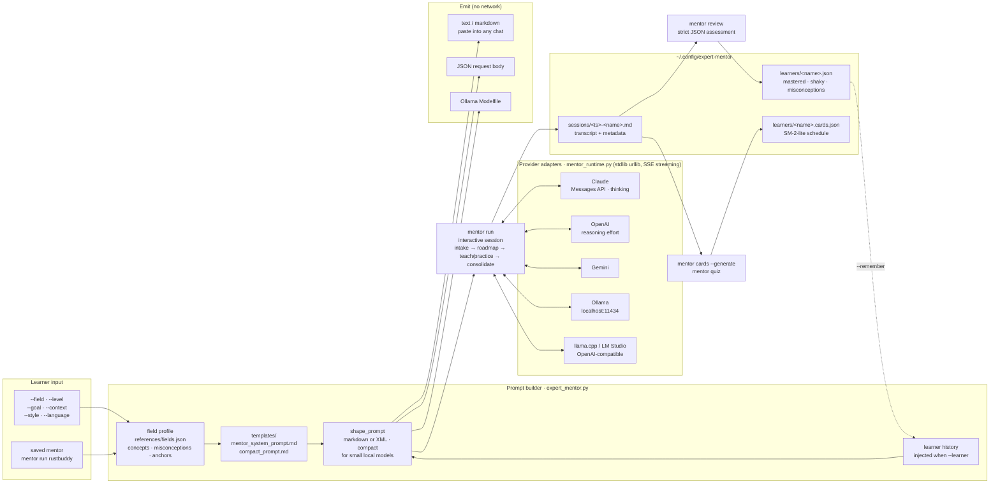
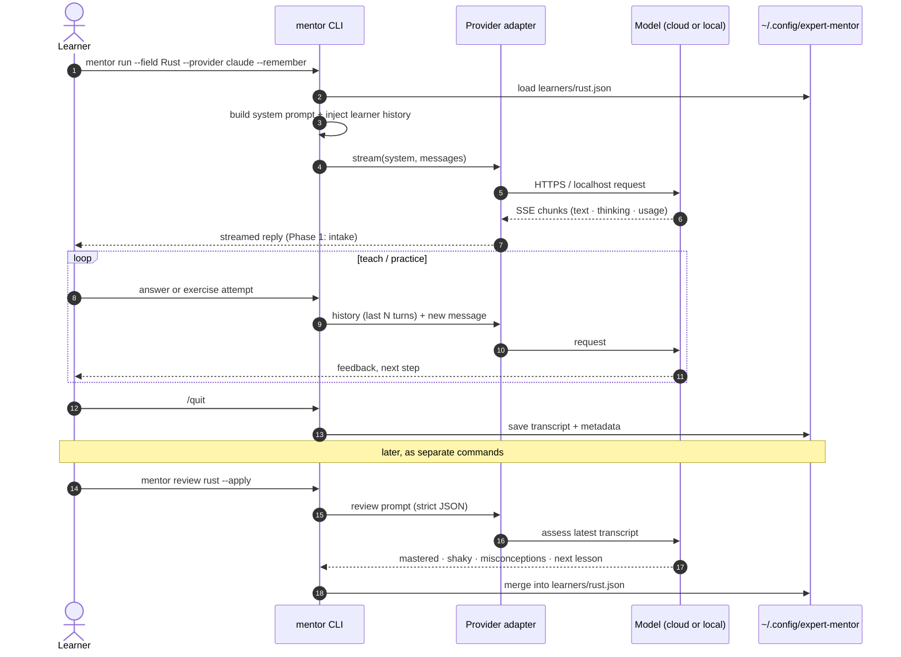

# expert-mentor diagrams

Rendered copies live in [`docs/images/`](images/). Related docs:
[commands](commands.md), [providers](providers.md), [learning](learning.md),
[configuration](configuration.md).

## From field to mentor

What happens between `mentor --field "Rust"` and a live session, and where the
learner's progress is kept afterwards.

## A `mentor run --remember` session

